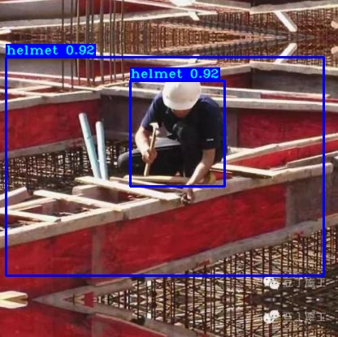

# Helmet_detaction_Using_YOLO-V3
What is YOLOv3? YOLOv3 (You Only Look Once, Version 3) is a real-time object detection algorithm that identifies specific objects in videos, live feeds, or images. YOLO uses features learned by a deep convolutional neural network to detect an object.

I have trained the model with a transfered coco-weights.

## Sample

# Before

# After detaction

